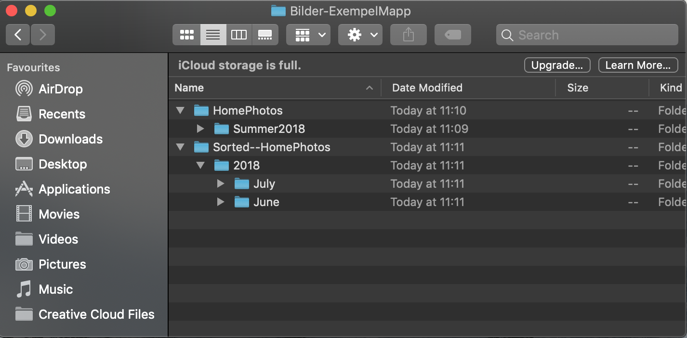

# Photo Organizer

## Introduction
Automate the process of copying and sorting personal-photos with the use of this Photo Organizer!

You may at some point have received a collection of photos from a friend or family member, and likely these photos also came straight from a digital camera in a large unsorted folder of photo files. 

This software aims to help you deal with these sorts of situations by automating the process of copying the photos and organizing them into new folders based on the Year and Month the photos were taken.

## Functionality

### Example of basic use
The following screenshots are a demonstration of the intended base functionality of the software.

Provide the program an input (folder path) by pointing it to a folder or directory containing your unsorted photos. In the picture below the input would be the folder path of the folder "HomePhotos".

The program will then search through the input folder and all its subfolders, and copy all the photos found into a new sorted folder where they are subsequently sorted into folders by year and subfolders by month. The picture below demonstrates how this output would look, given the input folder from the previous picture.

## Tools
Language: C++

### External libraries
easyexif: EXIF parsing library that extracts metadata from JPEG files (https://github.com/mayanklahiri/easyexif)

lsCpp: program that lists all files and subdirectories in a directory (https://github.com/gautamkmr/lsCpp)

## Installation and How To Use
Compatibility: MacOS, Linux

Current installation process requires cloning this GitHub repo. Once you have the repo and its files on your system, open your terminal and while in the [src](src/) directory, use the `make all`command. This will compile the code and generate the photo_sort.exe executable file. Use the command `./photo_sort` to run the program in the terminal.

The program will then ask you to provide the full folderpath to the folder which contains the photos you wish to copy. Provide this path without any extra symbols/characters surrounding it or any spaces at the beginning or end.

The program will then copy all photos into a newly created sorted folder which will be placed in the same directory as your input folder.

**Video demo:** https://www.youtube.com/watch?v=voIVj8qbFDs
